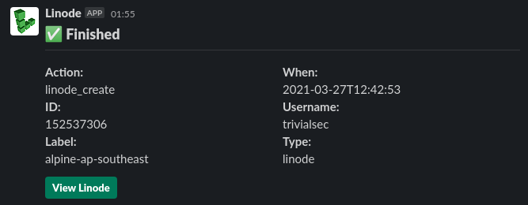
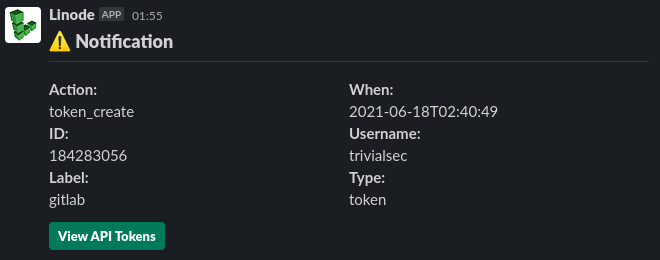
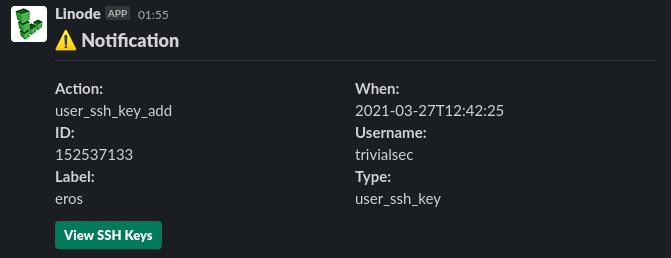
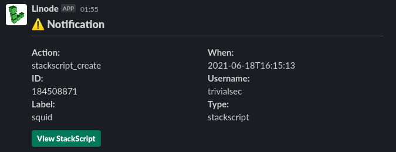

# Linode Events Slackbot

Publish Linode's Event notifications to Slack

## Create App

Go to [https://api.slack.com/apps/](https://api.slack.com/apps/) choose "Create New App" and "From scratch", give it the "App Name" `Linode` and select the workspace to develop your app in then click "Create App". In the "Add features and functionality" click "Incoming Webhooks" then switch this On (top right toggle).
Now scroll down and choose "Add New Webhook to Workspace" which will ask you to choose a channel to continue, click "Allow". Copy the "Webhook URL" and save it securely.

You can give the App a nice icon and custom color in "Basic Information" > "Display Information".

## Screenshots

